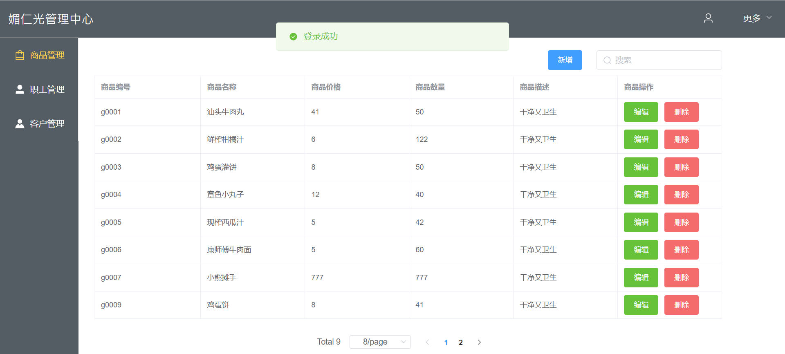
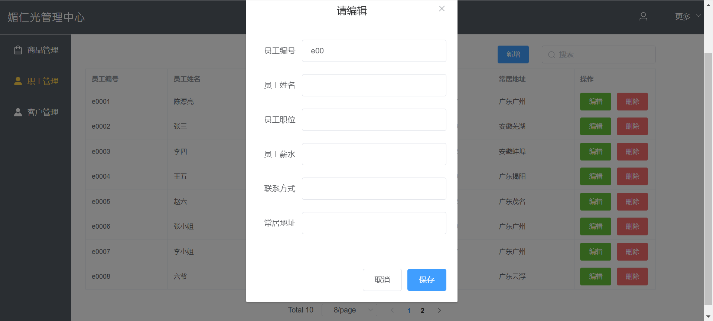
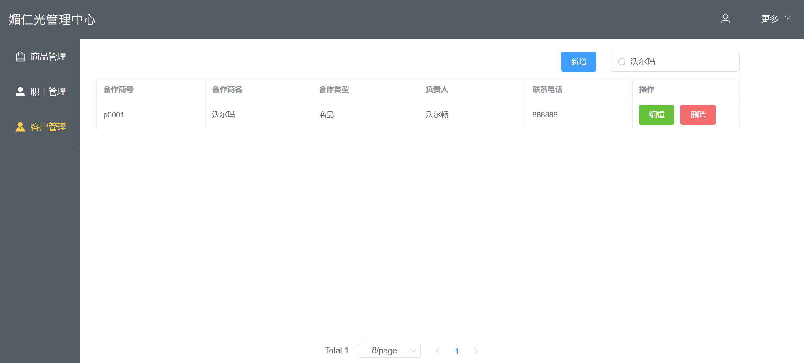

# SupermarketAdmin
## 超市管理系统

技术栈：Vue + Element Plus +  Springboot + Mysql

说明：
- 借助Element Plus完成前端页面制作，包括信息填写弹窗，数据分页管理，登录身份验证等。
- 利用Cookie存储用户信息，进入系统前进行用户信息判断。
- 封装axious与后端端口进行交互
- 借助Springboot,mybatis完成后端接口的编写，与数据库进行数据更新操作。

截图：

